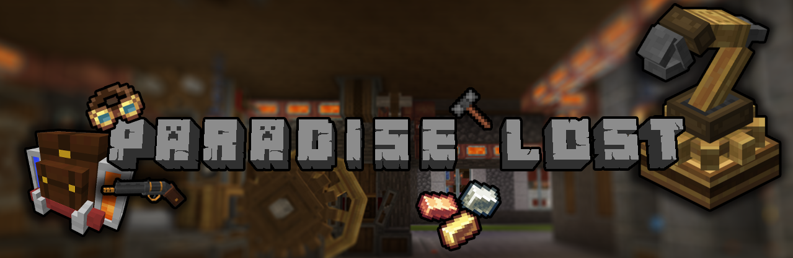

# Paradise-Lost
Documentation and support for the "Paradise Lost" modpack for Minecraft 1.16.5 from GrayTeamGaming

What started out as a small collection of mods for some friends at work has turned into an endeavor to produce a playable modpack for Minecraft 1.16.5 that represents the essence of what Minecraft is while improving on and expanding on it's features and gameplay. This modpack does not include any futuristic or magical technology. No laser beams and teleporters. Believability was the primary focus when building it and the main goal of this modpack is to add features and expand technology in a way that still feels like it fits the Minecraft universe. The goal of this modpack is not to utterly trivialize gameplay but to encourage creative engaging gameplay.

To that end, this modpack features and is built around the ["Create"](https://grayteammods.fandom.com/wiki/Create) and "Immersive Engineering" mods and includes many mods, addons, and additional custom resources designed to create a uniform experience and a sensible progression through technological tiers.

Ready to get started? [Here's How!](https://grayteammods.fandom.com/wiki/Getting_Started)  

Looking for info on a Mod? Visit the [Mod List](https://grayteammods.fandom.com/wiki/Mod_List) for a detailed list of all current mods as well as links to their individual pages.

Having issues or have suggestions? [Join the Discord!](https://discord.gg/zyxQYunwvZ)

Keep in mind this is currently a Work-In-Progress so if you don't see what you're looking for feel free to let me know. Also each page is going to be roughed out first and then gone back over for detail and completeness so you might see some WIP pages and missing content.
